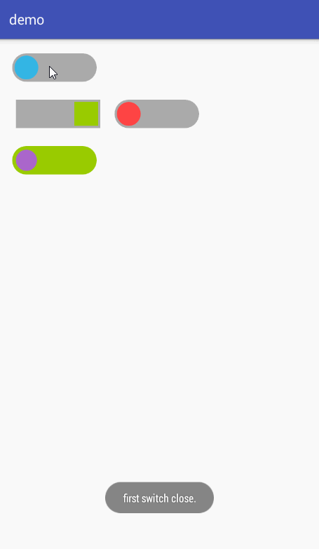

# slide-switch
A switch view for Android, it looks better than the official, support both slide and click.

Inspired by **[Leaking/SlideSwitch](https://github.com/Leaking/SlideSwitch)**, the rep is great but there are something which are unsuitable for me, so I modified some code and made this rep.

If you want to use this library, please check **[Leaking/SlideSwitch](https://github.com/Leaking/SlideSwitch)** first.

----------

## Screenshots


## Import
***Gradle***
```gradle
compile 'lic.swifter.ssw:switch:0.0.2'
```

***Maven***
```xml
<dependency>
  <groupId>lic.swifter.ssw</groupId>
  <artifactId>switch</artifactId>
  <version>0.0.2</version>
  <type>pom</type>
</dependency>
```

## Usage

***Define in xml:***
```xml
<lic.swifter.ssw.SlideSwitch
        android:layout_width="120dip"
        android:layout_height="40dip"
        android:layout_margin="10dip"
        switch:back_color="@android:color/darker_gray"
        switch:boundary_distance="3dip"
        switch:front_color="@color/colorAccent"
        switch:open_direction="right"
        switch:shape="circle"
        switch:slideable="true"
        switch:state="true"
        switch:switch_color="@android:color/holo_blue_light">
</lic.swifter.ssw.SlideSwitch>
```

***Set open or close:***
```java
slideSwitch.setState(boolean isOpen);
```

***Set listener:***
```java
firstSwitch.setSlideListener(new SlideSwitch.SlideListener() {
    @Override
    public void open() {
        //the SlideSwitch is open now
    }

    @Override
    public void close() {
        //the SlideSwitch is close now
    }
});
```

## All Attributes
```xml
<declare-styleable name="slide_switch">
    <attr name="front_color" format="color" />
    <attr name="back_color" format="color" />
    <attr name="switch_color" format="color" />
    <attr name="state" format="boolean" />
    <attr name="shape">
        <enum name="rect" value="1" />
        <enum name="circle" value="2" />
    </attr>
    <attr name="min_width" format="dimension" />
    <attr name="min_height" format="dimension" />
    <attr name="boundary_distance" format="dimension" />
    <attr name="open_direction" >
        <enum name="right" value="1" />
        <enum name="left" value="2" />
    </attr>
    <attr name="slideable" format="boolean" />
</declare-styleable>
```

## LICENSE

   Licensed under the Apache License, Version 2.0 (the "License");
   you may not use this file except in compliance with the License.
   You may obtain a copy of the License at

       http://www.apache.org/licenses/LICENSE-2.0

   Unless required by applicable law or agreed to in writing, software
   distributed under the License is distributed on an "AS IS" BASIS,
   WITHOUT WARRANTIES OR CONDITIONS OF ANY KIND, either express or implied.
   See the License for the specific language governing permissions and
   limitations under the License.